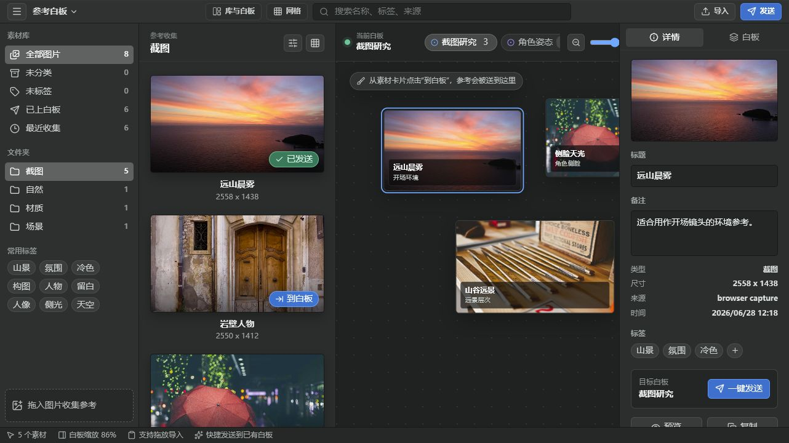

<div align="center">
  

# MOTZ 白板

面向 CG、概念设计与视觉创作的本地参考素材库与无限白板。

[](../../releases/latest)
[](../../releases/latest)
[](https://www.electronjs.org/)
[](#当前状态)

[下载最新版](../../releases/latest) · [查看更新日志](CHANGELOG.md) · [提交问题](../../issues)
</div>



## 下载

正式构建不提交到 Git 历史中，统一放在 [GitHub Releases](../../releases/latest)：

| 文件 | 适用场景 |
| --- | --- |
| `MOTZ-Whiteboard-Setup-0.3.83-x64.exe` | 常规安装，创建快捷方式并注册 `.motzboard` 文件 |
| `MOTZ-Whiteboard-Portable-0.3.83-x64.exe` | 免安装便携版，直接运行 |
| `MOTZ-browser-extension-0.1.11.zip` | Chrome / Edge 浏览器图片收集插件 |
| `SHA256SUMS-0.3.83.txt` | 下载文件完整性校验 |

当前 Windows 构建尚未进行商业代码签名，首次启动时可能出现 SmartScreen 提示。

## 核心能力

- **参考素材库**：多库切换、嵌套分类、标签、颜色筛选、本地文件夹扫描与垃圾桶。
- **无限白板**：平移、无级缩放、框选、多选、吸附、排列、复制粘贴、撤销与重做。
- **图片与视频**：图片和视频都会复制到素材库，原文件移动或删除后仍可使用。
- **浮窗参考**：无边框、可置顶、沉浸式工具栏，适合绘画和建模时保持参考可见。
- **文字节点**：粘贴纯文字、使用系统字体、调整颜色，并通过边界直接缩放。
- **可交换白板**：将排版保存为 `.motzboard` 文件，在其他电脑继续打开。
- **浏览器收集器**：在网页中拖动图片，直接保存到素材库或发送到当前白板。

## 常用操作

| 操作 | 功能 |
| --- | --- |
| 鼠标滚轮 | 缩放白板视口 |
| 鼠标中键拖动 | 平移视口 |
| 左键拖动空白处 | 框选节点 |
| `Shift` + 点击 | 累加选择 |
| `Delete` | 删除选中素材或白板节点 |
| `Ctrl+C` / `Ctrl+V` | 在白板内复制并粘贴到鼠标位置 |
| `Ctrl+Z` | 撤销 |
| `Ctrl+Y` / `Ctrl+Shift+Z` | 重做 |

## 浏览器插件

1. 下载并解压 `MOTZ-browser-extension-0.1.11.zip`。
2. 在 Chrome 打开 `chrome://extensions`，Edge 打开 `edge://extensions`。
3. 开启“开发者模式”，点击“加载已解压的扩展程序”。
4. 选择解压后的插件目录。
5. 保持 MOTZ 白板运行，在网页中拖动图片到悬浮入口。

插件只连接本机 `127.0.0.1` 的 MOTZ 接收服务，不会将图片发送到第三方服务器。

## 本地开发

需要 Node.js `20.19+` 或 `22.12+`。

```powershell
npm install
npm run electron:dev
```

构建 Windows 安装包与便携包：

```powershell
npm run package:win
npm run package:win:portable
```

构建结果位于 `release/`。创建 `v*` 标签并推送后，仓库内的 GitHub Actions 也可以自动构建 Release 文件。

## 项目结构

```text
browser-extension/  浏览器收集插件
build/              桌面应用图标
electron/           Electron 主进程与本地能力
public/             应用静态资源
src/                React 界面与白板逻辑
docs/images/        GitHub 页面图片
```

## 数据与隐私

- 素材库、白板和设置默认保存在本机。
- 图片导入后会在素材库目录保留副本。
- 图片和视频导入后都会在素材库目录保留独立副本。
- `.motzboard` 会内嵌当前白板使用的图片与视频，可发送给其他用户继续打开。
- 外部 `.motzboard` 中的素材先进入“白板素材”，由用户决定是否正式添加入库。

## 当前状态

MOTZ 白板仍处于 Beta 阶段，目前主要支持 Windows x64。macOS 构建需要在 macOS 设备或 macOS CI 环境中完成签名与验证。

当前仓库暂未附开放源代码许可证，默认保留所有权利。公开协作前请先确定合适的许可证。
