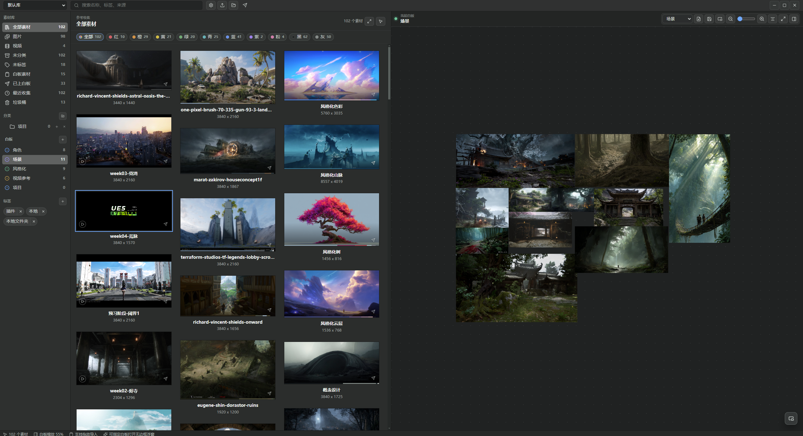
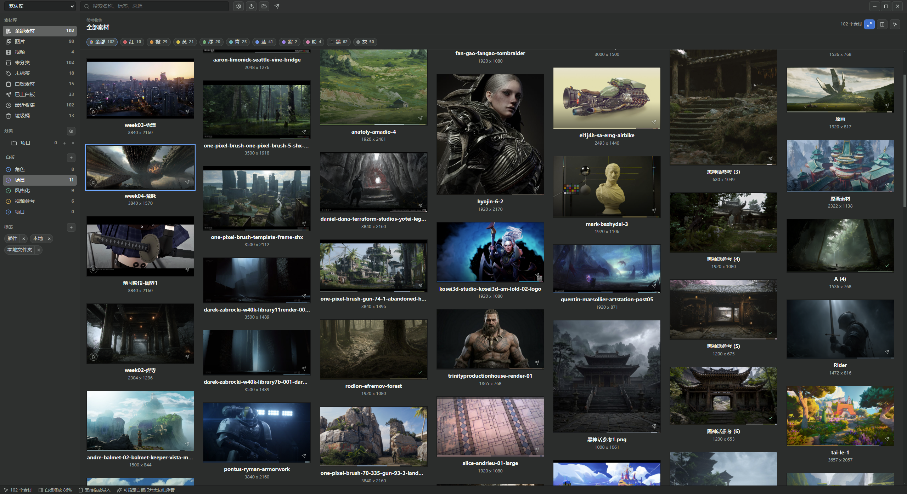
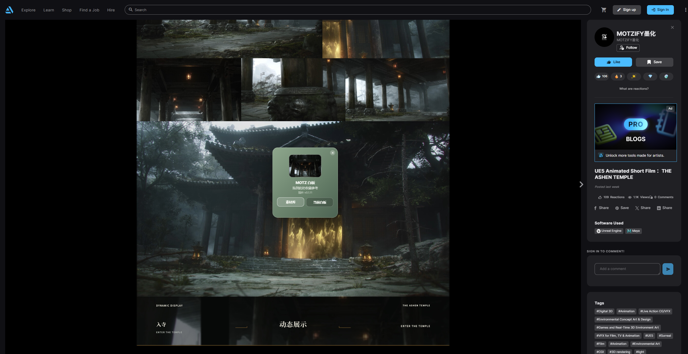
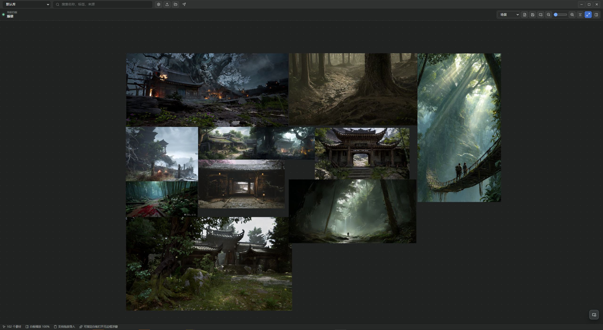

<div align="center">
  

# MOTZ 白板

**一个好用的素材库和自由白板。**

[下载](https://github.com/MotzifyStudio/Motz-Whiteboard/releases/latest) · [更新日志](CHANGELOG.md) · [问题反馈](https://github.com/MotzifyStudio/Motz-Whiteboard/issues)

<sub>Windows 10/11 x64 · Beta</sub>
</div>



## 为什么做 MOTZ

MOTZ 直接受 [PureRef](https://www.pureref.com/) 和 [Eagle](https://eagle.cool/) 启发。

PureRef 的自由画布很好用，但常见视频不在它的支持格式里，素材多了以后也缺少一个跨项目的库。

Eagle 很适合收图、分类和查找素材。真正开始做项目时，我们还需要一块自由白板，把这一批图片和视频摊开、调整大小、反复比较。

所以我们做了 MOTZ：素材平时放在库里，需要时再把图片、视频或文字送进白板。

MOTZ 也是我们为 [Motzify 最新创作课程](https://www.motzify.com/) 制作的 AI Coding 课程案例。感谢 PureRef、Eagle 和它们的作者。

## 素材库

MOTZ 可以建多个库。每个库都有自己的素材、分类、标签和白板，可以按项目或用途分开管理。



本地图片、视频、整个文件夹和剪贴板图片都能直接导入。装上浏览器收集器后，网页图片也可以收进库，或者直接送到当前白板。



图片和视频都会复制进库目录。同一份素材可以放进多个白板，不用重复导入；原始文件移动或删除后，库内副本仍可使用。

素材可以放进多级分类，也能用标签、名称、来源和主色查找。

## 白板

从库里选中素材，就可以直接送进白板。图片、视频和文字都可以自由摆放。画布支持缩放、平移、框选和自动排列，选中多项后也可以一起调整。



白板可以单独打开成无边框置顶窗口，放在绘图或建模软件旁边。浮窗不是只读预览，里面仍然可以继续调整内容。

需要带走某张白板时，可以保存为 `.motzboard`。图片、视频与排版会随白板保存，可以跨设备打开。

## 下载

目前只发布 Windows 10/11 x64 版本。[Releases](https://github.com/MotzifyStudio/Motz-Whiteboard/releases/latest) 同时提供安装版、单文件便携版和 Chrome / Edge 浏览器收集器。

安装包暂时没有代码签名，第一次运行时 Windows 可能显示 SmartScreen 提示。

浏览器收集器还没有上架扩展商店。下载压缩包后，需要在扩展管理页面选择“加载已解压的扩展程序”。具体步骤见 [`browser-extension/README.md`](browser-extension/README.md)。

## 数据放在哪里

设置、分类、标签和白板布局保存在 `%APPDATA%\MOTZ白板`。

导入的素材则在用户自定义的仓库位置进行保存。

## 目前的状态

MOTZ 还在 Beta，文件格式和数据结构仍可能调整，升级前最好先备份。

## 从源码运行

桌面端使用 Electron 31、React 19 和 Vite 6。`src/` 是界面和白板，`electron/` 负责文件、窗口和本机通信，`browser-extension/` 是浏览器收集器。

**环境要求**

需要 Node.js `20.19+` 或 `22.12+`。

```powershell
git clone https://github.com/MotzifyStudio/Motz-Whiteboard.git
cd Motz-Whiteboard
npm ci
```

**开发模式**

先启动 Vite，再打开另一个终端启动 Electron：

```powershell
npm run dev
```

```powershell
npm run electron:dev
```

**构建**

```powershell
npm run build
npm run package:win
npm run package:win:portable
```

完整的开发说明见 [`CONTRIBUTING.md`](CONTRIBUTING.md)。Bug 和功能建议可以直接发到 [Issues](https://github.com/MotzifyStudio/Motz-Whiteboard/issues)，安全问题请按 [`SECURITY.md`](SECURITY.md) 中的方式联系。
